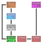

# High-level design

## Design principles

* Open standards, open source
* Modularity and extensibility
* Low cost
* Reliability

## Block diagram

The ULoC itself will consist of many layers or floors,
physically stacked over one another.
The first of these will contain an MCU and enough electronics to
control the machine and interface with a client machine.

The second floor will host mechanical actuators and transmission mechanisms.
These should have a focus on affordability.

The third floor will contain syringe pumps, valves and other "clean" hydraulic components.
These will receive input from all mechanical transmission lines arriving from below.
General inputs and outputs will be located outside the stack.

Finally, any subsequent floors will have room for the actual effectors and sensors,
including any fluidic channels and any electronics necessary for their operation.

All of this will be controlled by an Open Source firmware on the MCU and
a specialized software suite on the client machine (when connected).
This is quite a sweet spot for making sure the system is reliable.

Specialized laboratory protocols will be necessary,
those shall be encoded and provided for performing automated tasks and maintenance.
