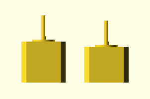

# Mechanical design
The mechanical floor will output controlled rotary motion to the hydraulic floor above.
This motion will be carried via multiple transmission lines.

## Motors

Widely available **NEMA17** stepper motors will be used.
These are commonly used for consumer products such as
[3D printers](https://reprap.com/wiki/NEMA_Motor).

There's a table of widely available such motors
[here](https://reprap.org/wiki/NEMA_17_Stepper_motor#Common_Stepper_Motor_Models);
ideally, a wide variety of models from that table should be usable,
to allow scrap parts to be used (e.g. a typical 3D printer has exactly 4 steppers).

## Multiplexers
Due to the relatively high cost of stepper motors and the slow pace of typical experiments,
it only makes sense to use a small number of steppers and
couple them to many transmission lines by means of mechanical multiplexers.

A reasonable default would be two independent motors, each controlling a number of axes.
Since each multiplexer requires a further stepper to select the output axis,
that amounts to four motors in total, the exact number present in typical consumer 3D printers.

Ideally, the multiplexer itself should only consist of inexpensive, widely available
hardware store parts and 3D printed elements.

See [mux](mux.md) for designs.

## Transmission lines
There are many ways to transmit a rotating motion:

* Belts: low durability and accuracy; flexible but now always simple to implement.
* CV joints: good characteristics, but expensive.
* Bevel gears: complex but accurate, and cheap if 3D printed.

A nice solution is to use threaded rods and bevel gears at right angles.

See [elbow](elbow.md) for designs.
