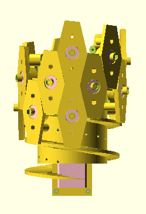

# Mechanical multiplexer design

## Design 1

[Files](mux1)

A spiral staircase design.
Both motors are mounted inside the structure,
which rotates and moves to choose an axis.
It allows the number of axes to be easily and modularly increased.

Drawbacks:
* Only supports two specific motor models.
* The heavy motors are mounted inside the structure.
* Unnecessary friction between some moving parts.
* High vertical clearance needed.
* Complex design.

## Design 2
Work in progress, should be simpler.
